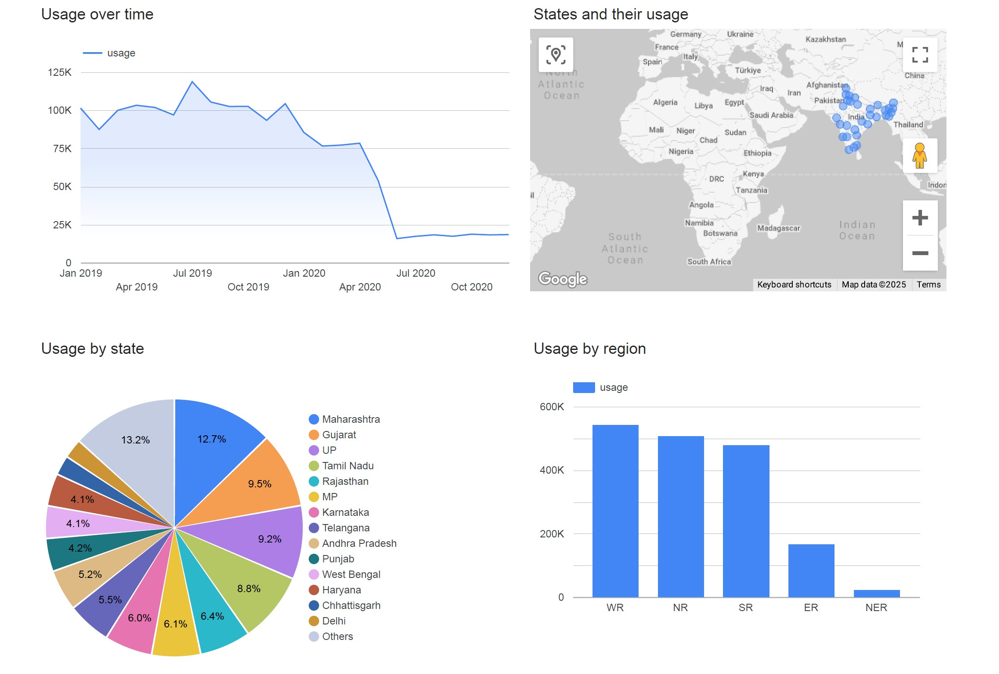
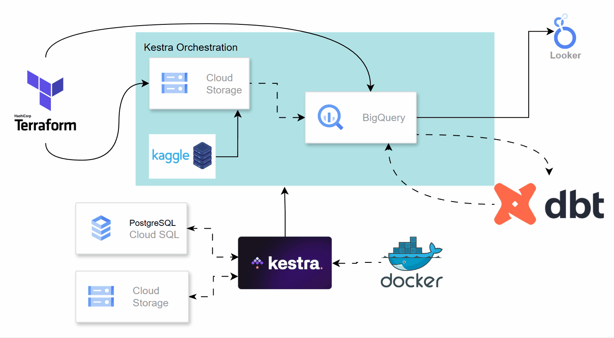
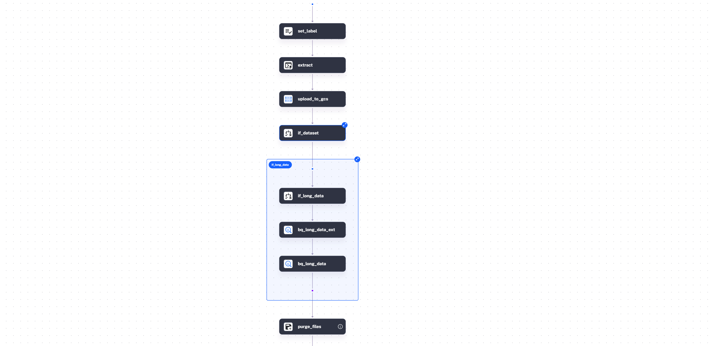
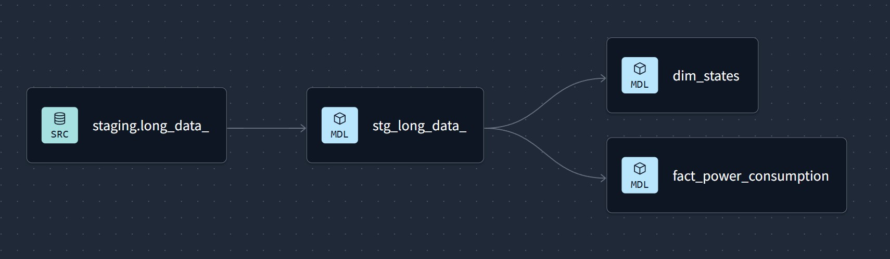

# Power consumption in India
## Project Overview
This project is part of the final step of the Data Engineer Zoomcamp and focuses on analyzing power consumption in India from 2019 to 2020. It uses an ELT (Extract, Load, Transform) approach with a broad stack of technologies to collect, clean, and process raw data. The goal is to uncover key insights and visualize them through an interactive dashboard, showcasing the full data engineering workflow from ingestion to presentation.



[Link to the dashboard in Looker Studio](https://lookerstudio.google.com/s/lks-IiY1zhU)
## Dataset
This time-series [dataset](https://www.kaggle.com/datasets/twinkle0705/state-wise-power-consumption-in-india/data) covers electricity consumption across Indian states from January 2019 to May 2020. Each entry shows the power used (in Mega Units) per state per day. Sourced from POSOCO’s weekly reports, it reflects regional consumption patterns, including the impact of the COVID-19 lockdown on energy use.
## Tech Stack

- **Terraform**: Used to provision and manage cloud infrastructure, including the creation of BigQuery datasets and storage buckets on GCP.

- **Docker**: Runs a containerized instance of the Kestra platform on a virtual machine in Google Cloud.

- **Kestra**: Serves as the workflow orchestration tool to automate and manage data pipelines.

- **DBT (Data Build Tool)**: Performs SQL-based data transformations in BigQuery, making data ready for analysis. The CLI version is used for automation.

- **Google Cloud Platform (GCP)**:
  - **Cloud Storage**: Acts as the data lake for storing raw data.
  - **BigQuery**: Functions as the central data warehouse.
  - **Looker Studio**: Provides interactive dashboards for data visualization.



## Steps to Reproduce the project
- Terraform:
    - Use the directory "Terraform" for run the commands
    ```bash
    terraform init #for start the configuration
    terraform plan #for check the possible changes on GCP
    terraform apply #for apply the changes on GCP
    ```
- Kestra installation:
    - Create a bucket in GCP for storage of Kestra
    - Create a PostgreSQL instance in GCP for database of Kestra
    - With a VM running on Compute Engine, run this command to download the Docker Compose file for Kestra:
    ``` bash
    curl -o docker-compose.yml https://raw.githubusercontent.com/kestra-io/kestra/develop/docker-compose.yml
    ```
    - Edit the docker-compose.yml:
    ```bash
    # set basic authentication to true
    kestra:
    server:
        basicAuth:
        enabled: true
        username: admin@kestra.io
        password: kestra

    # for postgresql
    datasources:
    postgres:
        url: jdbc:postgresql://<your-db-external-endpoint>:5432/<db_name>
        driverClassName: org.postgresql.Driver
        username: <your-username>
        password: <your-password>
    ## delete the depends_on section
    depends_on:
        postgres:
            condition: service_started

    # GCS
    kestra:
        storage:
            type: gcs
            gcs:
            bucket: "<your-cloud-storage-bucket-name>"
            projectId: "<your-gcp-project-name>"
            serviceAccount: "<stringified-json-file-contents>"
    ```
    - Run the docker container
    ```bash
    sudo docker compose up -d
    ```
- Kestra usage: Create flows using the files in the kestra-flows folder of this repository. Before run the flows, it's important to set the variables for the bucket name, zone, project ID, and credentials.

- DBT: Once the raw data is available in BigQuery, we’ll create a staging model to retrieve the data and use it as a source for the two main models: dim_states and fact_power_consumption.
    - Create a folder named staging and add the model stg_long_data.sql.
    - Create a folder named core with two files: dim_states.sql and fact_power_consumption.sql.
    - To create the consolidated tables of the star schema in BigQuery, run:
    ```bash
    dbt build
    ```

- Looker Studio: We'll create a connection to BigQuery and select our star schema. After that, add a line chart and a pie chart:
    - The line chart should use the month and year as the dimension, and usage (SUM) as the metric.
    - The pie chart should use the state as the dimension, and usage (SUM) as the metric.
## Conclusion
This project demonstrates the complete lifecycle of a modern data engineering pipeline, from raw data ingestion to interactive data visualization. By integrating tools such as Terraform, Kestra, DBT, and Looker Studio within the Google Cloud ecosystem, we effectively processed and analyzed power consumption data across Indian states. The final dashboard highlights meaningful trends, including the impact of the COVID-19 lockdown on electricity usage. This end-to-end solution showcases not only technical proficiency but also the ability to generate valuable insights through a scalable and reproducible workflow.
## Contact 
[Wiliam Quispe](https://www.linkedin.com/in/wiliamquispe)

## Disclaimer
AI has assisted me in creating the README file.